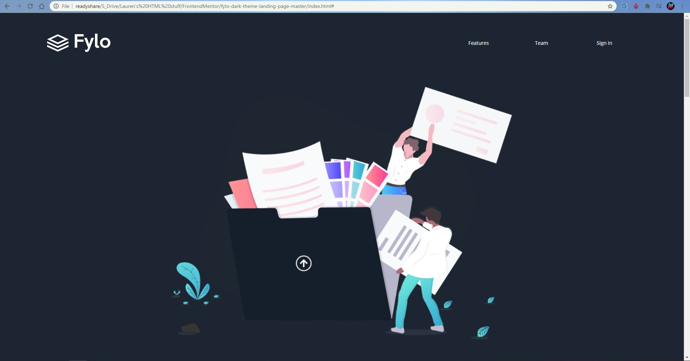

# Frontend Mentor - Fylo dark theme landing page solution

This is a solution to the [Fylo dark theme landing page challenge on Frontend Mentor](https://www.frontendmentor.io/challenges/fylo-dark-theme-landing-page-5ca5f2d21e82137ec91a50fd). Frontend Mentor challenges help you improve your coding skills by building realistic projects. 

## Table of contents

- [Overview](#overview)
  - [The challenge](#the-challenge)
  - [Screenshot](#screenshot)
  - [Links](#links)
- [My process](#my-process)
  - [Built with](#built-with)
  - [What I learned](#what-i-learned)
  - [Continued development](#continued-development)

- [Author](#author)

## Overview

### The challenge

Users should be able to:

- View the optimal layout for the site depending on their device's screen size
- See hover states for all interactive elements on the page

### Screenshot

### Links

- Live Site URL: https://commandermeow.github.io/Fylo-desk-theme-landing-page/

## My process

### Built with

- Semantic HTML5 markup
- CSS
- Flexbox

### What I learned

What have I learnt? I'm terrible when it comes to limiting what CSS I use so I don't repeat myself. It is definetly something I will be more aware of in the future as I have repeated myself far more then nessecary.

### Continued development

Along with trying to contain my CSS rambling habbit I need to work on my Javascipt. Although I only used a tiny amount in this project it is something that I need to improve on and hope to push in future projects!

## Author

- Website - Lauren Stroud (Still a work in progress)
- Frontend Mentor - Commander Meow(https://www.frontendmentor.io/profile/yourusername)

